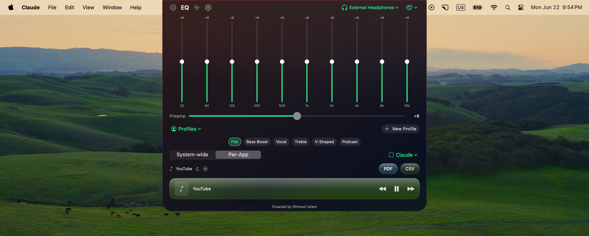
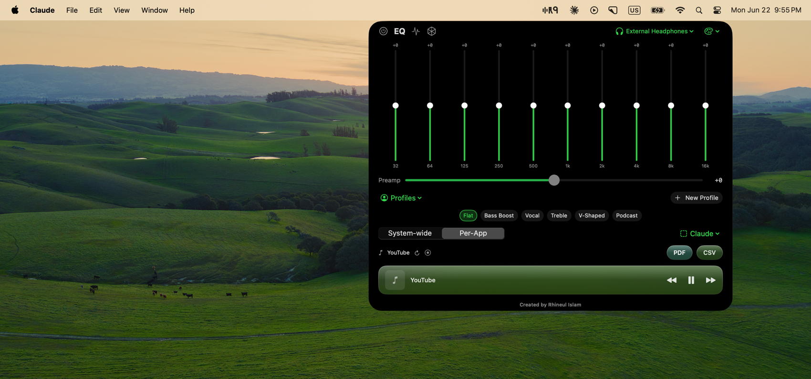
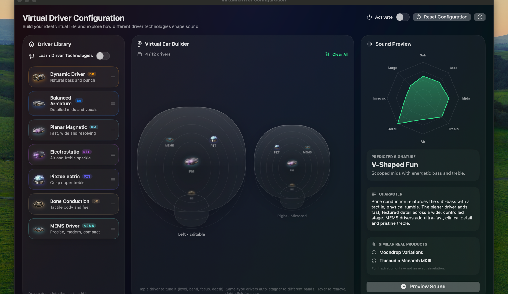
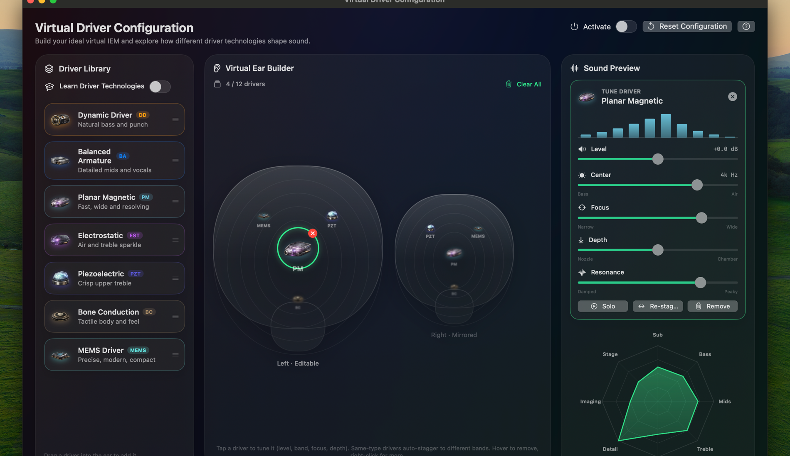
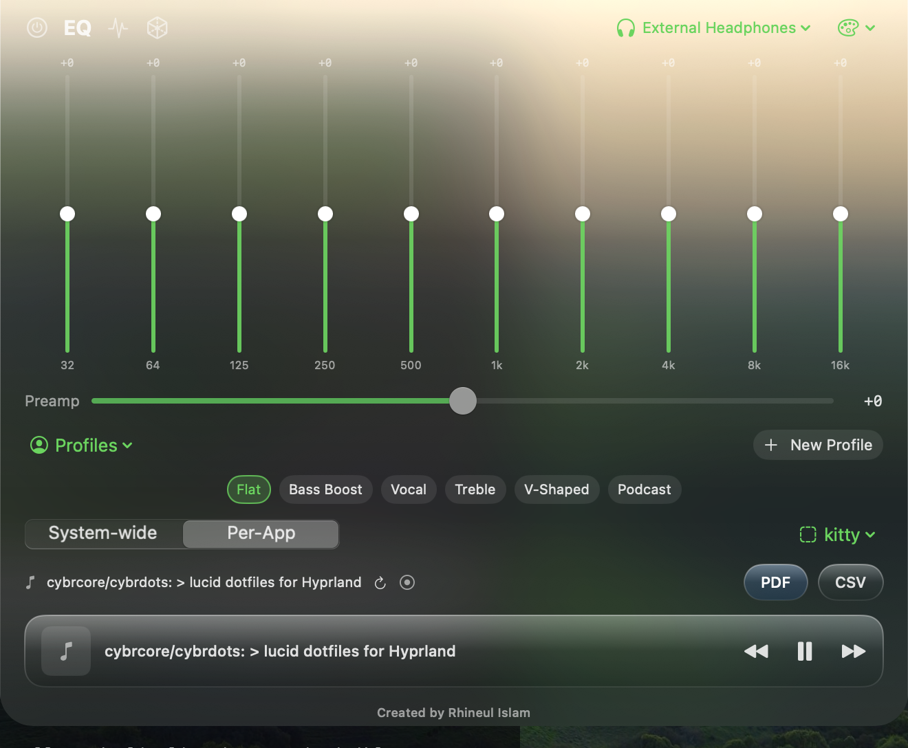
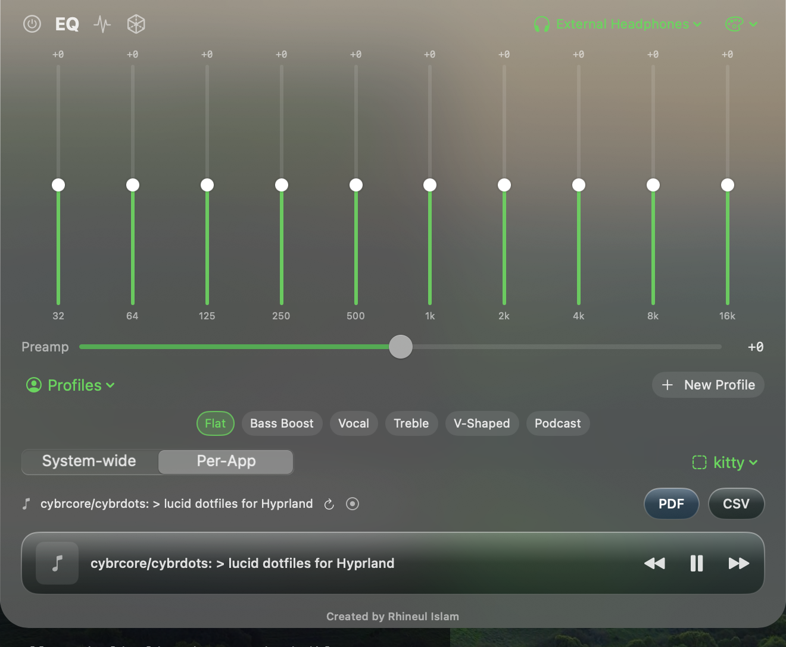
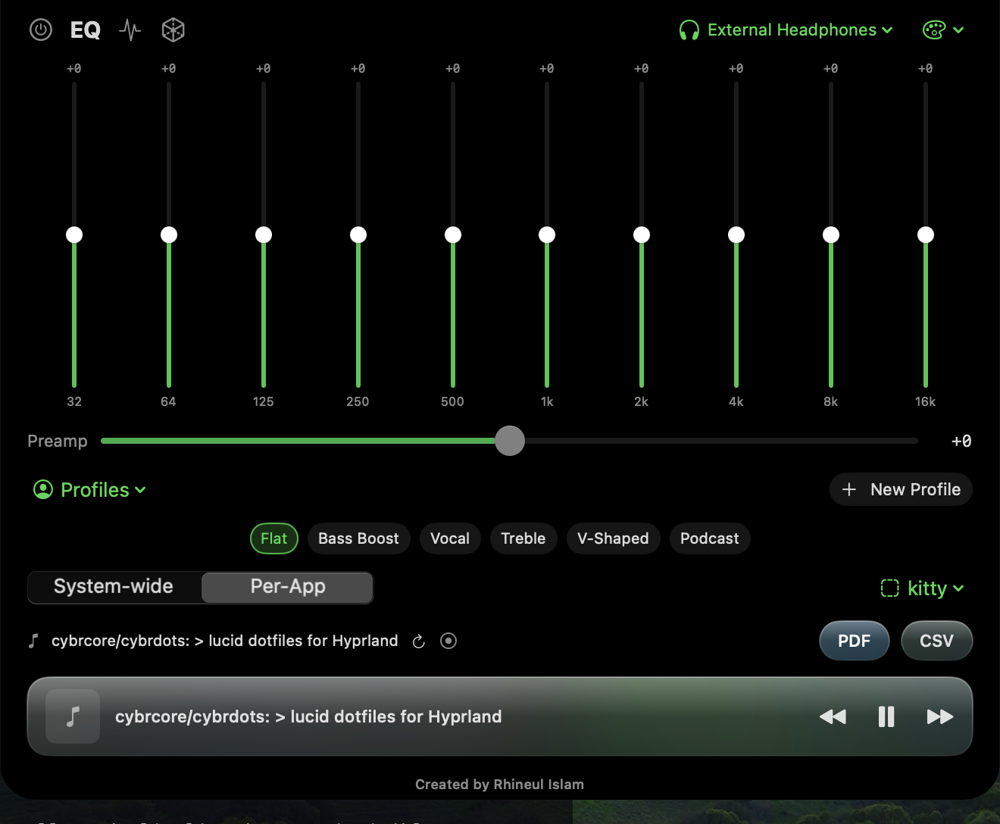
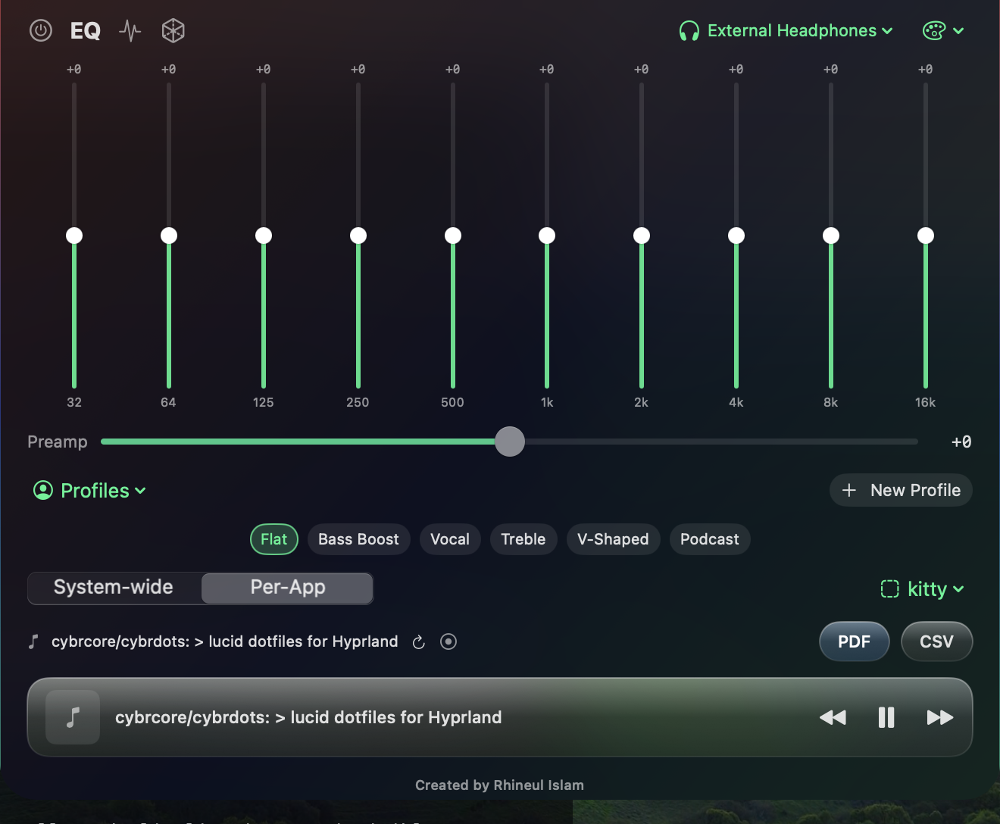

# R9-EQ

**A native macOS system-wide equalizer that lives in the notch.**

R9-EQ is a 10-band system-wide audio equalizer for macOS with a notch-integrated
interface that drops down like a native Apple control. It processes **all** of
your Mac's audio in real time using Apple's own Core Audio process-tap APIs — no
kernel extensions, no third-party audio router in the signal path — and adds a
one-of-a-kind **Virtual Driver Configuration** studio for designing and auditioning
hybrid IEM/headphone driver stacks.

> Created by **Rhineul Islam** · `com.rhine.EQ` · v0.1.1

**[⬇︎ Download the latest DMG](../../releases/latest)** · macOS 14.4+

---

## Showcase

**System-wide 10-band EQ, dropping down from the notch (Liquid Glass theme):**

**Per-app mode on the true-black System Default theme (OLED-friendly):**

**Virtual Driver Configuration — build a virtual IEM from stacked driver technologies:**

**Per-driver tuning with a live signature preview:**

### Themes

Every theme applies to **both** the notch panel and the VDC window.

| Liquid Glass | Frosted Glass |
|---|---|
|  |  |

| System Default (OLED black) | Cyberhax |
|---|---|
|  |  |

---

## Features

### Equalizer
- **10-band graphic EQ** (32 Hz → 16 kHz), ±12 dB per band, with a global preamp.
- **Real-time, system-wide** — equalizes every app's output at once (browser,
  Music, Spotify, games, calls).
- **Response-curve editor** — drag the live frequency curve directly, or use the
  vertical band sliders.
- **Presets** — Flat, Bass Boost, Vocal, Treble, V-Shaped, Podcast. The active
  preset is highlighted; any manual edit marks the curve as custom.
- **Profiles** — save, name, switch, import and export your own EQ profiles.
- **Per-app EQ** — System-wide mode, or Per-App mode that auto-loads a saved curve
  whenever a given app comes to the foreground.

### Virtual Driver Configuration (VDC)
A studio for building a "virtual IEM" out of stacked driver technologies (Dynamic,
Balanced Armature, Electrostatic, Planar Magnetic, MEMS, Piezoelectric, Bone
Conduction). Driver voicings and stacking rules are grounded in published IEM
engineering research.
- **Drag-and-drop driver stacking** with authentic, per-kind frequency envelopes.
- **Per-driver tuning** — Level, Center, Focus, Depth and Resonance per instance.
  Adding multiples of the same driver auto-staggers their voicing (the way real
  manufacturers bin and tune duplicate drivers).
- **Depth modelling** — front/rear driver placement shaped like physical stacks.
- **Live preview** — apply the virtual driver to the real EQ and listen.
- **Export** — a full PDF report (colored per-driver curves + combined response +
  tuning table) and CSV data. **Import/export the whole configuration** as JSON so
  you can share builds with others.

### Design & system integration
- **Menu-bar mode (default)** — an **R9 menu-bar icon** appears in your menu bar
  on every Mac; click it to open or close the panel, which floats just below the
  bar as a fully-rounded popover. It's the default because it's easy to find on
  any machine (and it's the only sensible affordance on Macs without a notch —
  Mac mini, iMac, Studio displays, pre-notch MacBooks).
- **Notch drop-down (opt-in on notch MacBooks)** — turn off *Menu-Bar Mode*
  (Theme menu → **Layout**) and the panel pours down out of the notch instead,
  with a fast, smooth Apple-style spring (a GPU layer-mask reveal — the content is
  laid out once and never re-flows, so there's no jank), rounded bottom corners
  matching the notch radius, and opens on hover / closes when the pointer leaves.
- **Four themes**, applied to both the notch panel and the VDC window:
  - **Liquid Glass** — translucent glossy glass.
  - **Frosted Glass** — heavier matte frost.
  - **System Default** — follows macOS appearance (true-black/OLED in Dark Mode,
    native light surface in Light Mode).
  - **Cyberhax** — the "Lucid" cyberpunk palette (red/blue/green neon, near-black
    base), inspired by [cybrcore/cybrdots](https://github.com/cybrcore/cybrdots).
- **Now-playing media bar** — shows the current track (Music / Spotify / browser)
  with transport controls.
- **Record the EQ'd output** — mirror processed audio to *BlackHole 16ch* so screen
  recorders can capture the equalized sound.

---

## How it works

R9-EQ does **not** put BlackHole in your output path. It uses Apple's modern
Core Audio process-tap stack (macOS 14.4+):

1. A **system audio process tap** captures every other process's output.
2. A **private aggregate device** wraps that tap together with your real output
   device, with tap auto-start enabled.
3. A raw **`AudioDeviceIOProc`** runs the DSP on the audio thread and writes the
   processed signal straight back to the hardware — unity gain, no volume loss.
4. The DSP core is **10 RBJ peaking biquads per channel** (Direct-Form-I
   transposed), with coefficients recomputed lock-free from an atomic parameter
   snapshot, and NaN/Inf self-healing so a transient can never latch the filter
   into digital silence.

This is why R9-EQ is loud (no halving of volume), low-latency, and reliable from
the first click — and why it needs the **System Audio Recording** permission.

---

## Requirements

- **macOS 14.4 or later** for the system-wide EQ (the process-tap engine).
- Apple Silicon or Intel Mac.
- Grants the **System Audio Recording** permission on first start.
- *BlackHole 16ch* is only needed for the optional "record the EQ'd output" mirror
  — not for normal equalization.

---

## Install

1. Download **`R9-EQ.dmg`** from the [latest release](../../releases/latest).
2. Open it and drag **R9-EQ** to **Applications**.
3. **First launch** — this build is ad-hoc signed (not yet notarized), so
   Gatekeeper will block a normal double-click. Either:
   - **Right-click R9-EQ → Open → Open**, or
   - System Settings → Privacy & Security → **Open Anyway**, or
   - `xattr -dr com.apple.quarantine /Applications/R9-EQ.app`
4. Approve the **System Audio Recording** prompt (System Settings → Privacy &
   Security → System Audio Recording). This is required — without it the EQ
   produces silence.
5. Click the **R9 menu-bar icon** (it appears in your menu bar by default on every
   Mac) to open the panel, then press the power button to start the EQ.

---

## Usage

- **Open the panel** — click the **R9 menu-bar icon** (default). Click it again,
  or click away, to close.
- **Power** — top-left power button starts/stops the EQ.
- **Curve vs sliders** — toggle with the waveform icon.
- **Virtual Driver** — the cube icon opens the VDC studio.
- **Output device / Theme** — the headphones and palette menus on the right.
- **Layout** — Theme menu → **Layout → Menu-Bar Mode**. On a notch MacBook, turn
  it off to use the notch drop-down instead (hover the notch to open).

---

## Privacy

R9-EQ processes audio entirely **on-device**. It captures system audio only to
equalize it in real time; nothing is recorded, stored, or transmitted unless you
explicitly enable the *BlackHole 16ch* recording mirror. The now-playing readout
uses the local Media Remote info for the track title/artist only.

---

## Credits

- **Created by Rhineul Islam.**
- Cyberhax theme palette: the "Lucid" scheme from
  [cybrcore/cybrdots](https://github.com/cybrcore/cybrdots) /
  [cybrcore/cybrcolors](https://github.com/cybrcore/cybrcolors).
- Optional recording mirror uses [BlackHole](https://github.com/ExistentialAudio/BlackHole).

---

## License

© 2026 Rhineul Islam. All rights reserved.

> This repository hosts the public release (app download + documentation) only.
> The R9-EQ source code is closed.
